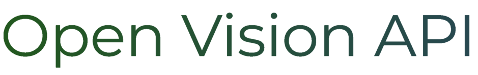

<div align="center">
<p align="center">
  </img>
</p>

[]()
[](https://www.gnu.org/licenses/agpl-3.0)
[](https://github.com/PyCQA/bandit)

</div>

## 🌟 Project Description

Open Vision API is an open source computer vision API that uses deep learning models for object detection.

<div align="center">

</div>

## 🚀 Quick Start

The following instructions detail how to set up the ova-server. For information regarding the ova-client and a quick demo of the API functionality, visit [ova-client](https://github.com/openvisionapi/ova-client).

You need to have [just](https://github.com/casey/just) installed in your system.

### Installation

1. Set up a local environment using TensorFlow as the backend framework.

```
$ just setup-tensorflow
```

> See [documentation](https://openvisionapi-documentation.readthedocs.io/en/latest/) for a list of supported deep learning frameworks.

2. Download the models.

```bash
$ source .venv/bin/activate
$ ./cli.py download --model=yolov4 --framework=tensorflow_lite --hardware=cpu
```

### Usage

1. Run the ova-server.

```bash
$ just run-with-tensorflow-lite

[2023-02-24 00:01:07 +0100] [1869009] [INFO] Starting gunicorn 20.1.0
[2023-02-24 00:01:07 +0100] [1869009] [INFO] Listening at: http://0.0.0.0:8000 (1869009)
[2023-02-24 00:01:07 +0100] [1869009] [INFO] Using worker: sync
[2023-02-24 00:01:07 +0100] [1869031] [INFO] Booting worker with pid: 1869031
```

2. Get the official client.

```bash
$ git clone https://github.com/openvisionapi/ova-client
$ cd ova-client
$ just psetup
$ source .venv/bin/activate
$ DETECTION_URL=http://localhost:8000/api/v1/detection ./ova_client.py detection images/cat.jpeg
```

> For more information about the ova-client, please visit https://github.com/openvisionapi/ova-client.

## ⛏️ Built Using

- [Flask](https://github.com/pallets/flask)
- [Marshmallow](https://github.com/marshmallow-code/marshmallow)
- [Pillow](https://github.com/python-pillow/Pillow)
- [Numpy](https://github.com/numpy/numpy)
- [TensorFlow](https://github.com/tensorflow/tensorflow)
- [TensorFlow Lite](https://github.com/tensorflow/tensorflow)

## ✍️ Author

[Badr BADRI](https://github.com/pythops)

## 🤝 Contributions

All contributions are welcome!

### Setting up the Development Environment

To set up the development environment, simply run the command:

```
$ just dev
```

### Code Style Checks

Black and mypy are used to ensure that contributions are stylized in a uniform manner.

- [Black](https://github.com/psf/black) is used for code formatting
- [mypy](https://github.com/python/mypy) is used for static typing

## 🔧 Tests

To run the tests, simply use the commands:

```
$ just dev
$ just test
```

## 📄 Documentation

The complete documentation can be found by visiting
https://openvisionapi-documentation.readthedocs.io/en/latest/

## ⚖️ License

AGPLv3

Copyright © 2021-2023 Badr BADRI @pythops
